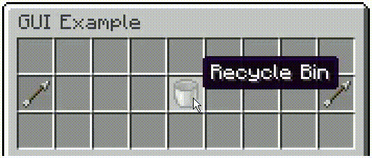

# A GUI Framework for Minecraft Mapmaking Using In-Game Commands

> **CURRENTLY INCOMPATIBLE WITH VERSIONS 1.20.5 AND ABOVE!**
>
> **Minecraft 24w09a has brought [significant changes to the way in which item properties are stored and represented](https://www.minecraft.net/en-us/article/minecraft-snapshot-24w09a). As a result, the datapack at its current state will no longer function in versions 1.20.5 and above. There will be a major update to support future versions, but this is expected to take some time due to the project's nature.**


<p align = "center">
  
</p>

<p align = "center">
  <i>A GUI example demonstrating some of the datapack's capabilities, which was made in less than 5 minutes and in-game!</i>
</p>

## Overview

Minecraft servers frequently use custom user interfaces that utilize the inventory of a container (e.g., a chest), the items of which serve as interactable elements. While there are plugins making the design of such menus trivial to server developers, Minecraft commands and, by extension, datapacks are much harder to work with, and their limitations often make it difficult to replicate these item-based GUIs in situations where plugins are not available.

Certain datapacks as well as datapack generators have been made with the intent to provide command developers with a GUI framework. However, these are usually basic, being restricted to essential features that rarely go beyond the creation of buttons and page navigation, while they may often not be designed with robustness into account. Furthermore, existing approaches involve datapack templates in which the logic of specific GUIs is hard-coded, requiring users to understand and modify part of the code. As such, the use of such datapacks may be unreasonable for large projects, either due to their limitations or lack of convenience.

The aim of this datapack is to serve as an advanced framework allowing users to easily create and maintain complex and robust item-based GUIs in-game, without writing any code or ever touching the datapack. This is achieved by simply dragging and dropping items with custom NBT tags in containers within a world, which the datapack can use to generate GUIs according to users' specifications. At the moment, the datapack is limited to block entities, such as barrels, droppers, hoppers or even brewing stands. However, there are future plans for personalized GUIs (i.e., using chest boats) that involve storing individual players' GUI instances in a database.

The datapack has the following features:

* NBT standard for quick and easy creation of advanced item-based GUIs
* Completely in-game workflow, with the entire datapack being a black box that the developer can ignore
* Robust design, support for multiplayer and no interference with player inventories
* Complete documentation, in-game tutorial and demos

## Downloading, Installing and Updating

The datapack can be downloaded from this repository by clicking on "Code" and then "Download ZIP". The folder inside the ZIP file is the datapack. After this folder has been added to the "datapacks" folder of a Minecraft world, ``/reload`` needs to be run in-game. A list of the datapack's commands is available via ``/function ajjgui:_help``. By convention, all user functions begin with an underscore, ``_``, to be distinguished from the backend ones.

| User Function                   | Description                                  |
|:--------------------------------|:---------------------------------------------|
| ``/function ajjgui:_compile``   | Compiles GUI                                 |
| ``/function ajjgui:_copyright`` | Displays datapack copyright information      |
| ``/function ajjgui:_decompile`` | Decompiles GUI                               |
| ``/function ajjgui:_help``      | Displays list of datapack user commands      |
| ``/function ajjgui:_install``   | Installs datapack                            |
| ``/function ajjgui:_kit``       | Gives GUI design and compilation kit         |
| ``/function ajjgui:_manual``    | Displays datapack manual link                |
| ``/function ajjgui:_reload``    | Reloads GUIs                                 |
| ``/function ajjgui:_tutorial``  | Displays GUI design and compilation tutorial |
| ``/function ajjgui:_uninstall`` | Uninstalls datapack                          |
| ``/function ajjgui:_version``   | Displays datapack version                    |
| ``/function ajjgui:_widget/``   | Gives GUI demo widgets                       |

The datapack can be installed by running ``/function ajjgui:_install`` at any location in the world, which generates a shulker box. This needs to be located in a loaded chunk for the datapack to be fully functional and cannot be destroyed. The shulker box can be relocated by repeating the installation command elsewhere. Any updated versions of the datapack are automatically installed at the same location upon reloading the world. The datapack can be uninstalled using ``/function ajjgui:_uninstall``, which removes all data associated with it from the world and decompiles any existing GUIs.

## Creating a GUI

The datapack adopts the concept of [graphical widgets](https://en.wikipedia.org/wiki/Graphical_widget), present in real-world user interfaces. Within the scope of Minecraft's item-based GUIs, and this datapack specifically, every item in a GUI corresponds to an interactive element (e.g., a button).

There are 8 types of GUI widgets available:

* [Placeholder](#placeholder)
* [Button](#button)
* [Counter](#counter)
* [Switch](#switch)
* [Radiobutton](#radiobutton)
* [Itembin](#itembin)
* [Itemslot](#itemslot)
* [Scrollbutton](#scrollbutton)

An in-game tutorial on how to create a GUI is available via ``/function ajjgui:_tutorial``. The tutorial provides the player with premade demo widgets to experiment with. Multiple examples are given, both here and in-game, to help provide a better understanding of their custom NBT. The following section explains all the different types of widgets available and how they can be customized. Once obtained, these items can be placed inside shulker boxes, with each shulker box corresponding to a different GUI page. The shulker boxes can be arranged based on their page number and compiled to build a functional GUI in-game. This manual can be accessed with ``/function ajjgui:_manual``.

## List of GUI Widgets

> **NOTE:** Some of the following commands are too long to fit in the chat box and need to be executed using a command block.

> **NOTE:** For custom NBT, it is important to check that the right data types are being used (e.g., ``{ajjgui:{Exit:1b}}`` and not ``{ajjgui:{Exit:1}}``), that values are within the specified range (e.g., ``{ajjgui:{Exit:1b}}`` and not ``{ajjgui:{Exit:2b}}``, where ``ajjgui.Exit`` here can only be ``0b`` or ``1b``) and that there are no errors (e.g., forgetting to set an item's ``Count`` value within the commonly used format ``{id:<item id>,Count:<item count>,tag:<item tags>}`` sets it to zero, which is not immediately noticeable when the compound is nested in custom tags such as the ``ajjgui.Items`` list for post-compiler use). The GUI compiler is only capable of initializing required NBT with default values and does not detect errors or adjust data, unlike the game, which often does this with its own NBT (e.g., changing types, removing redundancy). While there are cases where errors in custom NBT, such as incorrect data types, may be internally resolved by the datapack at later stages, this behavior is inconsistent and must not be assumed.

> **NOTE:** The ``ajjgui.Command``, ``ajjgui.Exit``, ``ajjgui.Fixed``, ``ajjgui.Page`` and ``ajjgui.Relative`` NBT tags are covered separately in later sections.

### Placeholder

The *placeholder* is a widget that cannot be interacted with and is used to display an item.

| NBT Tag           | Default                             | Type           |
|:------------------|:------------------------------------|:---------------|
| ``ajjgui.Fixed``  | ``0b``                              | Boolean (Byte) |
| ``ajjgui.Widget`` | Required (``"placeholder"`` or N/A) | String         |

#### Usage

```
/give @p <item id>{ajjgui:{Widget:"placeholder",<optional ajjgui tags>}}
```

#### Example

A *placeholder*:

```
/give @p minecraft:light_gray_stained_glass_pane{ajjgui:{Widget:"placeholder"},display:{Name:'{"text":"","italic":false}'}}
```

<p align = "center">
  
</p>

> **NOTE:** If a GUI slot is empty, the GUI compiler adds a light gray stained glass pane *placeholder* with a blank name in its place.

> **NOTE:** If the ``ajjgui.Widget`` NBT tag of any item is not specified, it is set to ``"placeholder"`` by default. Therefore, the entire ``ajjgui`` argument for any *placeholder* is optional, and no specific tags are required.

### Button

The *button* is a widget that changes the GUI page, exits the GUI and/or runs a GUI command when clicked. More information can be found in the following sections.

| NBT Tag             | Default                 | Type           |
|:--------------------|:------------------------|:---------------|
| ``ajjgui.Command``  | N/A                     | String         |
| ``ajjgui.Exit``     | ``0b``                  | Boolean (Byte) |
| ``ajjgui.Fixed``    | ``0b``                  | Boolean (Byte) |
| ``ajjgui.Page``     | N/A                     | Byte           |
| ``ajjgui.Relative`` | ``0b``                  | Boolean (Byte) |
| ``ajjgui.Widget``   | Required (``"button"``) | String         |

#### Usage

```
/give @p <item id>{ajjgui:{Widget:"button",<optional ajjgui tags>}}
```

#### Examples

More information about [changing GUI pages](#changing-gui-pages), [exiting GUIs](#exiting-guis) and [running GUI commands](#running-gui-commands-and-accessing-data).

### Counter

The *counter* is a widget that changes to a different count of the same item when clicked, following a value sequence. The value sequence is specified in the ``ajjgui.Values`` NBT tag. The default value is the one initially used upon creation of the widget. Once a *counter* in its default state is clicked, it changes to the second value in the list and so on. Hence, the first one is not used until the end of the first cycle. After one cycle, the first value is always used instead of the default one. The current state of a *counter* is stored in the ``ajjgui.State`` NBT tag.

| NBT Tag             | Default                  | Type           |
|:--------------------|:-------------------------|:---------------|
| ``ajjgui.Command``  | N/A                      | String         |
| ``ajjgui.Exit``     | ``0b``                   | Boolean (Byte) |
| ``ajjgui.Fixed``    | ``0b``                   | Boolean (Byte) |
| ``ajjgui.Page``     | N/A                      | Byte           |
| ``ajjgui.Relative`` | ``0b``                   | Boolean (Byte) |
| ``ajjgui.State``    | ``0b``                   | Byte           |
| ``ajjgui.Values``   | Required                 | Byte List      |
| ``ajjgui.Widget``   | Required (``"counter"``) | String         |

#### Usage

```
/give @p <item id>{ajjgui:{Widget:"counter",Values:[<value 1>,<value 2>,…,<value N>],<optional ajjgui tags>}} <default value>
```

where N is the number of states.

#### Examples

1. A *counter* repeating the sequence 1 to 16, starting with 1. The default value is the same as the first value in ``ajjgui.Values``:

```
/give @p minecraft:black_stained_glass_pane{ajjgui:{Widget:"counter",Values:[1b,2b,3b,4b,5b,6b,7b,8b,9b,10b,11b,12b,13b,14b,15b,16b]},display:{Name:'{"text":"Count:","italic":false}'}}
```

2. A *counter* repeating the sequence 1 to 4, starting with 1. The default value is the same as the first value in ``ajjgui.Values``:

```
/give @p minecraft:black_stained_glass_pane{ajjgui:{Widget:"counter",Values:[1b,2b,3b,4b]},display:{Name:'{"text":"Count:","italic":false}'}}
```

3. A *counter* beginning with a default value of 64, followed by the sequence 2 to 16, that continues by repeating the sequence 1 to 16:

```
/give @p minecraft:black_stained_glass_pane{ajjgui:{Widget:"counter",Values:[1b,2b,3b,4b,5b,6b,7b,8b,9b,10b,11b,12b,13b,14b,15b,16b]},display:{Name:'{"text":"Count:","italic":false}'}} 64
```

4. A *counter* repeating the sequence 1 to 16, starting with 16. The default value is the same as the first value in ``ajjgui.Values`` (now rearranged). The value of ``ajjgui.State`` is set to ``1b`` to match the states:

```
/give @p minecraft:black_stained_glass_pane{ajjgui:{Widget:"counter",Values:[16b,1b,2b,3b,4b,5b,6b,7b,8b,9b,10b,11b,12b,13b,14b,15b],State:15b},display:{Name:'{"text":"Count:","italic":false}'}} 16
```

<p align = "center">
  
</p>

### Switch

The *switch* is a widget that changes to a different item when clicked, following an item sequence. The item sequence is specified in the ``ajjgui.Items`` NBT tag. The default item is the one initially used upon creation of the widget. Once a *switch* in its default state is clicked, it changes to the second item in the list and so on. Hence, the first one is not used until the end of the first cycle. After one cycle, the first item is always used instead of the default one. The current state of a *switch* is stored in the ``ajjgui.State`` NBT tag.

| NBT Tag             | Default                 | Type           |
|:--------------------|:------------------------|:---------------|
| ``ajjgui.Command``  | N/A                     | String         |
| ``ajjgui.Exit``     | ``0b``                  | Boolean (Byte) |
| ``ajjgui.Fixed``    | ``0b``                  | Boolean (Byte) |
| ``ajjgui.Items``    | Required                | Compound List  |
| ``ajjgui.Page``     | N/A                     | Byte           |
| ``ajjgui.Relative`` | ``0b``                  | Boolean (Byte) |
| ``ajjgui.State``    | ``0b``                  | Byte           |
| ``ajjgui.Widget``   | Required (``"switch"``) | String         |

#### Usage

```
/give @p <default item id>{ajjgui:{Widget:"switch",Items:[<item 1>,<item 2>,…,<item N>],<optional ajjgui tags>}}
```

where N is the number of states.

#### Examples

1. A *switch* changing between a "Disabled" and an "Enabled" state, starting with "Disabled". The default item is the same as the first item in ``ajjgui.Items``:

```
/give @p minecraft:gray_dye{ajjgui:{Widget:"switch",Items:[{id:"minecraft:gray_dye",Count:1b,tag:{display:{Name:'{"text":"Disabled","italic":false}'}}},{id:"minecraft:lime_dye",Count:1b,tag:{display:{Name:'{"text":"Enabled","italic":false}'}}}]},display:{Name:'{"text":"Disabled","italic":false}'}}
```

2. A *switch* changing between a "Disabled", an "Enabled" and a "Neutral" state, starting with "Disabled". The default item is the same as the first item in ``ajjgui.Items``:

```
/give @p minecraft:gray_dye{ajjgui:{Widget:"switch",Items:[{id:"minecraft:gray_dye",Count:1b,tag:{display:{Name:'{"text":"Disabled","italic":false}'}}},{id:"minecraft:lime_dye",Count:1b,tag:{display:{Name:'{"text":"Enabled","italic":false}'}}},{id:"minecraft:purple_dye",Count:1b,tag:{display:{Name:'{"text":"Neutral","italic":false}'}}}]},display:{Name:'{"text":"Disabled","italic":false}'}}
```

3. A *switch* beginning with a default state, "Default", that continues by changing between a "Disabled" and an "Enabled" state, starting with "Enabled":

```
/give @p minecraft:purple_dye{ajjgui:{Widget:"switch",Items:[{id:"minecraft:gray_dye",Count:1b,tag:{display:{Name:'{"text":"Disabled","italic":false}'}}},{id:"minecraft:lime_dye",Count:1b,tag:{display:{Name:'{"text":"Enabled","italic":false}'}}}]},display:{Name:'{"text":"Default","italic":false}'}}
```

4. A *switch* changing between a "Disabled" and an "Enabled" state, starting with "Enabled". The default item is the same as the first item in ``ajjgui.Items`` (now rearranged). The value of ``ajjgui.State`` is set to ``1b`` to match the states:

```
/give @p minecraft:lime_dye{ajjgui:{Widget:"switch",Items:[{id:"minecraft:lime_dye",Count:1b,tag:{display:{Name:'{"text":"ON","italic":false}'}}},{id:"minecraft:gray_dye",Count:1b,tag:{display:{Name:'{"text":"OFF","italic":false}'}}}],State:1b},display:{Name:'{"text":"ON","italic":false}'}}
```

<p align = "center">
  
</p>

### Radiobutton

The *radiobutton* is a widget that changes between an "OFF" and "ON" state item when clicked. It comes in groups in which only one widget can be toggled on at a time, with the rest being toggled off. Each item is specified in the ``ajjgui.OFF`` and ``ajjgui.ON`` NBT tags. The default item is the one initially used upon creation of the widget. Once a *radiobutton* is clicked, it changes to the item corresponding to its "ON" state, and all the other *radiobutton* widgets with the same group identifier change to their "OFF" state. The group identifier of a *radiobutton* is stored in the ``ajjgui.Group`` NBT tag. The current state of a *radiobutton* is stored in the ``ajjgui.State`` NBT tag.

| NBT Tag             | Default                      | Type           |
|:--------------------|:-----------------------------|:---------------|
| ``ajjgui.Command``  | N/A                          | String         |
| ``ajjgui.Exit``     | ``0b``                       | Boolean (Byte) |
| ``ajjgui.Fixed``    | ``0b``                       | Boolean (Byte) |
| ``ajjgui.Group``    | ``0b``                       | Byte           |
| ``ajjgui.OFF``      | Required                     | Compound       |
| ``ajjgui.ON``       | Required                     | Compound       |
| ``ajjgui.Page``     | N/A                          | Byte           |
| ``ajjgui.Relative`` | ``0b``                       | Boolean (Byte) |
| ``ajjgui.State``    | ``0b``                       | Byte           |
| ``ajjgui.Widget``   | Required (``"radiobutton"``) | String         |

#### Usage

```
/give @p <default item id>{ajjgui:{Widget:"radiobutton",OFF:<off item>,ON:<on item>,<optional ajjgui tags>}}
```

#### Examples

1. A *radiobutton* on group ``0b`` changing between a "Not Selected" and a "Selected" state, starting with "Not Selected":

```
/give @p minecraft:gray_dye{ajjgui:{Widget:"radiobutton",OFF:{id:"minecraft:gray_dye",Count:1b,tag:{display:{Name:'{"text":"Not Selected","italic":false}'}}},ON:{id:"minecraft:lime_dye",Count:1b,tag:{display:{Name:'{"text":"Selected","italic":false}'}}},Group:0b},display:{Name:'{"text":"Not Selected","italic":false}'}}
```

2. A *radiobutton* on group ``0b`` beginning with a default state, "Default", that continues by changing between a "Not Selected" and a "Selected" state, starting with "Selected":

```
/give @p minecraft:purple_dye{ajjgui:{Widget:"radiobutton",OFF:{id:"minecraft:gray_dye",Count:1b,tag:{display:{Name:'{"text":"Not Selected","italic":false}'}}},ON:{id:"minecraft:lime_dye",Count:1b,tag:{display:{Name:'{"text":"Selected","italic":false}'}}},Group:0b},display:{Name:'{"text":"Default","italic":false}'}}
```

3. A *radiobutton* on group ``0b`` changing between a "Not Selected" and a "Selected" state, starting with "Selected". The value of ``ajjgui.State`` is set to ``1b`` to match the states:

```
/give @p minecraft:lime_dye{ajjgui:{Widget:"radiobutton",OFF:{id:"minecraft:gray_dye",Count:1b,tag:{display:{Name:'{"text":"Not Selected","italic":false}'}}},ON:{id:"minecraft:lime_dye",Count:1b,tag:{display:{Name:'{"text":"Selected","italic":false}'}}},Group:0b,State:1b},display:{Name:'{"text":"Selected","italic":false}'}}
```

<p align = "center">
  
</p>

### Itembin

The *itembin* is a widget that clears all items inserted by the player in a particular slot in the GUI.

| NBT Tag             | Default                  | Type           |
|:--------------------|:-------------------------|:---------------|
| ``ajjgui.Command``  | N/A                      | String         |
| ``ajjgui.Exit``     | ``0b``                   | Boolean (Byte) |
| ``ajjgui.Fixed``    | ``0b``                   | Boolean (Byte) |
| ``ajjgui.Page``     | N/A                      | Byte           |
| ``ajjgui.Relative`` | ``0b``                   | Boolean (Byte) |
| ``ajjgui.Widget``   | Required (``"itembin"``) | String         |

#### Usage

```
/give @p <item id>{ajjgui:{Widget:"itembin",<optional ajjgui tags>}}
```

#### Example

An *itembin*:

```
/give @p minecraft:bucket{ajjgui:{Widget:"itembin"},display:{Name:'{"text":"Recycle Bin","italic":false}'}}
```

<p align = "center">
  
</p>

> **NOTE:** The *itembin* has a built-in cooldown of 0.4s.

### Itemslot

The *itemslot* is a widget that stores items inserted by the player in a particular slot in the GUI. Once one or more stacked items are inserted, the current ones occupying the slot (if any) are replaced and returned to the player's inventory. When the *itemslot* is not being used, a placeholder item occupies the slot. This is stored in the ``ajjgui.Placeholder`` NBT tag. The maximum number of items in an *itemslot* is stored in the ``ajjgui.Size`` NBT tag, which cannot be larger than ``64b``. Any excess items are returned to the player. Whether an *itemslot* has an item in it is determined by the ``ajjgui.State`` NBT tag.

| NBT Tag                | Default                   | Type           |
|:-----------------------|:--------------------------|:---------------|
| ``ajjgui.Command``     | N/A                       | String         |
| ``ajjgui.Exit``        | ``0b``                    | Boolean (Byte) |
| ``ajjgui.Fixed``       | ``0b``                    | Boolean (Byte) |
| ``ajjgui.Page``        | N/A                       | Byte           |
| ``ajjgui.Placeholder`` | Required                  | Compound       |
| ``ajjgui.Relative``    | ``0b``                    | Boolean (Byte) |
| ``ajjgui.Size``        | ``64b``                   | Byte           |
| ``ajjgui.State``       | ``0b``                    | Byte           |
| ``ajjgui.Widget``      | Required (``"itemslot"``) | String         |

#### Usage

```
/give @p <default item id>{ajjgui:{Widget:"itemslot",Placeholder:<placeholder item>,<optional ajjgui tags>}}
```

#### Examples

1. An empty *itemslot* with a default placeholder item identical to the one specified in ``ajjgui.Placeholder`` and a stack size of ``64b``:

```
/give @p minecraft:gray_stained_glass_pane{ajjgui:{Widget:"itemslot",Placeholder:{id:"minecraft:gray_stained_glass_pane",Count:1b,tag:{display:{Name:'{"text":"Placeholder Item","italic":false}'}}},Size:64b},display:{Name:'{"text":"Placeholder Item","italic":false}'}}
```

2. An empty *itemslot* with a default placeholder item identical to the one specified in ``ajjgui.Placeholder`` and a stack size of ``16b``:

```
/give @p minecraft:gray_stained_glass_pane{ajjgui:{Widget:"itemslot",Placeholder:{id:"minecraft:gray_stained_glass_pane",Count:1b,tag:{display:{Name:'{"text":"Placeholder Item","italic":false}'}}},Size:16b},display:{Name:'{"text":"Placeholder Item","italic":false}'}}
```

3. An empty *itemslot* with a default placeholder item different from the one specified in ``ajjgui.Placeholder`` and a stack size of ``64b``:

```
/give @p minecraft:white_stained_glass_pane{ajjgui:{Widget:"itemslot",Placeholder:{id:"minecraft:gray_stained_glass_pane",Count:1b,tag:{display:{Name:'{"text":"Placeholder Item","italic":false}'}}},Size:64b},display:{Name:'{"text":"Default Placeholder Item","italic":false}'}}
```

4. An *itemslot* with an item in it by default and a stack size of ``64b``. The value of ``ajjgui.State`` is set to ``1b`` as the slot is occupied:

```
/give @p minecraft:diamond_sword{ajjgui:{Widget:"itemslot",Placeholder:{id:"minecraft:gray_stained_glass_pane",Count:1b,tag:{display:{Name:'{"text":"Placeholder Item","italic":false}'}}},Size:64b,State:1b},display:{Name:'{"text":"Default Item","italic":false}'}}
```

<p align = "center">
  
</p>

> **NOTE:** The *itemslot* has a built-in cooldown of 0.4s.

### Scrollbutton

The *scrollbutton* is a widget that cycles one or more lists of *static* widgets (see notes) across respective GUI slot lists when clicked. This allows for additional space in the GUI. Each widget list is specified in the ``ajjgui.Widgets`` NBT tag. Within each widget list, widgets are added in the order they appear in. The slot list associated with each widget list is specified in the ``ajjgui.Slots`` NBT tag. Within each slot list, slots are added in the order they are occupied by the respective widget list. The *scrollbutton* also contains the entire functionality of the *switch*, including the ``ajjgui.Items`` and ``ajjgui.State`` NBT tags.

| NBT Tag             | Default                       | Type               |
|:--------------------|:------------------------------|:-------------------|
| ``ajjgui.Command``  | N/A                           | String             |
| ``ajjgui.Exit``     | ``0b``                        | Boolean (Byte)     |
| ``ajjgui.Fixed``    | ``0b``                        | Boolean (Byte)     |
| ``ajjgui.Items``    | N/A                           | Compound List      |
| ``ajjgui.Page``     | N/A                           | Byte               |
| ``ajjgui.Relative`` | ``0b``                        | Boolean (Byte)     |
| ``ajjgui.Slots``    | Required                      | Byte List List     |
| ``ajjgui.State``    | ``0b``                        | Byte               |
| ``ajjgui.Widget``   | Required (``"scrollbutton"``) | String             |
| ``ajjgui.Widgets``  | Required                      | Compound List List |

#### Usage

```
/give @p <item id>{ajjgui:{Widget:"scrollbutton",Widgets:[[<widget 1,1>,<widget 1,2>,…,<widget 1,L_1>],[<widget 2,1>,<widget 2,2>,…,<widget 2,L_2>],…,[<widget N,1>,<widget N,2>,…,<widget N,L_N>]],Slots:[[<slot 1,1>,<slot 1,2>,…,<slot 1,M_1>],[<slot 2,1>,<slot 2,2>,…,<slot 2,M_2>],…,[<slot N,1>,<slot N,2>,…,<slot N,M_N>]],<optional ajjgui tags>}}
```

where L_x and M_y are the numbers of widgets and slots in each widget list and slot list respectively, and N is the number of widget list and slot list pairs.

#### Example

A *scrollbutton* cycling 6 buttons across GUI slots 11, 12, 13 and 14. Each button leads to a different page when clicked. There is a single widget list of length 6 and a single slot list of length 4:

```
/give @p minecraft:spectral_arrow{ajjgui:{Widget:"scrollbutton",Widgets:[[{id:"minecraft:paper",Count:1b,tag:{ajjgui:{Widget:"button",Page:0b},display:{Name:'{"text":"Select","italic":false}'}}},{id:"minecraft:paper",Count:2b,tag:{ajjgui:{Widget:"button",Page:1b},display:{Name:'{"text":"Select","italic":false}'}}},{id:"minecraft:paper",Count:3b,tag:{ajjgui:{Widget:"button",Page:2b},display:{Name:'{"text":"Select","italic":false}'}}},{id:"minecraft:paper",Count:4b,tag:{ajjgui:{Widget:"button",Page:3b},display:{Name:'{"text":"Select","italic":false}'}}},{id:"minecraft:paper",Count:5b,tag:{ajjgui:{Widget:"button",Page:4b},display:{Name:'{"text":"Select","italic":false}'}}},{id:"minecraft:paper",Count:6b,tag:{ajjgui:{Widget:"button",Page:5b},display:{Name:'{"text":"Select","italic":false}'}}}]],Slots:[[11b,12b,13b,14b]]},display:{Name:'{"text":"Next","italic":false}'}}
```

<p align = "center">
  
</p>

> **NOTE:** The *scrollbutton* only supports the *placeholder*, *button* and *itembin* widgets.

> **NOTE:** If the ``ajjgui.Widget`` NBT tag of any widget is not specified, it is set to ``"placeholder"`` by default. Therefore, the entire ``ajjgui`` argument for any *placeholder* is optional, and no specific tags are required. This, by extension, applies to a *placeholder* widget specified in the ``ajjgui.Widgets`` NBT tag of the *scrollbutton*.

## Changing GUI Pages

Each of the widgets discussed previously, excluding the *placeholder*, can be made to change the GUI page when clicked. This is done by specifying a page number in the ``ajjgui.Page`` NBT tag. By default, this value is the index of the shulker box in the chest previously used to compile the GUI, where a value of ``0b`` corresponds to the first page. If it is equal to the number of pages, the count resets back to the first page, and negative values may also be used to access pages from the end. The ``ajjgui.Relative`` NBT tag can be set to ``1b`` in order for the value of ``ajjgui.Page`` to increment the page number from its current value. This, hence, assumes that the current page has an index of ``0b`` and uses this as a reference instead of the first one.

#### Examples

1. A *button* setting the GUI page to the first one:

```
/give @p minecraft:arrow{ajjgui:{Widget:"button",Page:0b},display:{Name:'{"text":"Go to First Page","italic":false}'}}
```

2. A *button* setting the GUI page to the last one:

```
/give @p minecraft:arrow{ajjgui:{Widget:"button",Page:-1b},display:{Name:'{"text":"Go to Last Page","italic":false}'}}
```

3. A *button* setting the GUI page to the next one:

```
/give @p minecraft:arrow{ajjgui:{Widget:"button",Page:1b,Relative:1b},display:{Name:'{"text":"Go to Next Page","italic":false}'}}
```

4. A *button* setting the GUI page to the previous one:

```
/give @p minecraft:arrow{ajjgui:{Widget:"button",Page:-1b,Relative:1b},display:{Name:'{"text":"Go to Previous Page","italic":false}'}}
```

<p align = "center">
  
</p>

## Fixed GUI Widgets

Each of the widgets discussed previously can be made to stay on display when the GUI page is changed. This is done by setting the ``ajjgui.Fixed`` NBT tag to ``1b``. If a *scrollbutton* is made fixed, its widgets also obtain this property.

#### Example

A *button* staying fixed in its slot when the GUI page is changed:

```
/give @p minecraft:arrow{ajjgui:{Widget:"button",Page:1b,Relative:1b,Fixed:1b},display:{Name:'{"text":"Go to Next Page","italic":false}'}}
```

## Exiting GUIs

Each of the widgets discussed previously, excluding the *placeholder*, can be made to exit the GUI when clicked. This is done by setting the ``ajjgui.Exit`` NBT tag to ``1b``.

#### Example

A *button* exiting the GUI:

```
/give @p minecraft:barrier{ajjgui:{Widget:"button",Exit:1b},display:{Name:'{"text":"Exit","color":"white","italic":false}'}}
```

## Running GUI Commands and Accessing Data

| Scoreboard Score    | Exported Data     |
|:--------------------|:------------------|
| ``@s ajjgui.count`` | Widget item count |
| ``@s ajjgui.page``  | Page number       |
| ``@s ajjgui.slot``  | Widget slot       |
| ``@s ajjgui.state`` | Widget state      |

| Data Storage NBT        | Exported Data                         | Type          |
|:------------------------|:--------------------------------------|:--------------|
| ``ajjgui:gui In``       | *Itembin* or *itemslot* item inserted | Compound      |
| ``ajjgui:gui Out``      | *Itemslot* item removed               | Compound      |
| ``ajjgui:gui Page``     | Page                                  | Compound List |
| ``ajjgui:gui Widget``   | Widget                                | Compound      |

Each of the widgets discussed previously, excluding the the *placeholder*, can be made to run commands or functions when clicked. This is done by specifying a command in the ``ajjgui.Command`` NBT tag. This command is executed by the player interacting with the widget. Within the command's execution, it is possible to access data exported from the GUI interaction (e.g., whether a *switch* is toggled on) and use it to make decisions.

#### Examples

1. A *button* running a command referencing the player that pressed it:

```
/give @p minecraft:arrow{ajjgui:{Widget:"button",Page:1b,Relative:1b,Command:"say @s pressed button to Next Page"},display:{Name:'{"text":"Go to Next Page","italic":false}'}}
```

2. A *switch* running a command based on its current state:

```
/give @p minecraft:gray_dye{ajjgui:{Widget:"switch",Items:[{id:"minecraft:gray_dye",Count:1b,tag:{display:{Name:'{"text":"Disabled","italic":false}'}}},{id:"minecraft:lime_dye",Count:1b,tag:{display:{Name:'{"text":"Enabled","italic":false}'}}}],Command:"function name:func"},display:{Name:'{"text":"Disabled","italic":false}'}}
```

where the following commands are located in a function ```name:func``` within a map's datapack:

```
execute if score @s ajjgui.state matches 0 run say set switch to Disabled
execute if score @s ajjgui.state matches 1 run say set switch to Enabled
```

## Directly Modifying GUIs

For every GUI compiled, there is a marker entity located at the container's coordinates with the ``"ajjgui.gui"`` scoreboard tag. This entity stores the page value in its ``ajjgui.page`` score as well as the page list in its ``data.GUI`` NBT tag. Each element in this list corresponds to a page, storing widgets in the same format containers use to store items. If the available widget types and tags do not already support a particular functionality, the page number and widget NBT may be directly modified to achieve desired results. This would, for example, be needed if one wanted to modify a GUI without prior user interaction. If the modification command is not triggered by a player using a GUI, ``/function ajjgui:_reload`` must follow in the same tick for any changes to be reflected in the GUI. If this is omitted, the mismatch in NBT between the marker entity and the container makes the datapack assume that a player is interacting indefinitely with this GUI and results in malfunction of other active GUIs.

#### Examples

1. A command setting the nearest GUI's page to the first one:

```
/scoreboard players set @e[type=minecraft:marker,tag=ajjgui.gui,sort=nearest,limit=1] ajjgui.page 0
```

Then, in the same tick (not required if the above command is run from a widget):

```
/function ajjgui:_reload
```

2. A command setting the nearest GUI's first page's first slot item's id to stone:

```
/data modify entity @e[type=minecraft:marker,tag=ajjgui.gui,sort=nearest,limit=1] data.GUI[0][{Slot:0b}].id set value "minecraft:stone"
```

Then, in the same tick (not required if the above command is run from a widget):

```
/function ajjgui:_reload
```

> **NOTE:** The GUI compiler adds the ``ajjgui.Slot`` and ``ajjgui.Compiled`` NBT tags to each widget. These two must not be changed when directly modifying NBT.

> **NOTE:** Widgets with the ``ajjgui.Fixed`` NBT tag set to ``1b`` appear in a new page only when the page is loaded by clicking on widget that has the ``ajjgui.Page`` NBT tag. Directly changing a page therefore does not preserve fixed widgets unless they were already cached in the destination page from a previous interaction.

> **NOTE:** Decompiling a GUI resets it to the state it was in when compiled.

## Copyright

Copyright © 2021 - 2024 Ajj (https://github.com/AjjMC/ajjgui)

This project was released under the MIT License. Please credit this datapack if you use it in your work by providing a link to the project repository.
