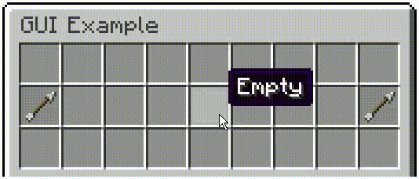

# A Custom GUI Mapmaking Framework Using In-Game Minecraft Commands (Minecraft: Java Edition Datapack)

<p align = "center">
  
</p>

<p align = "center">
  <i>The above GUI example was made in-game, in less than 5 minutes, using less than 10 commands!</i>
</p>

## Abstract

Custom user interfaces in Minecraft are very often used by creators to enhance their servers and maps, providing better player experience and increased product quality. While it is apparent that servers have the convenience of using plugins to base their menus on item-based GUIs, vanilla means, such as datapacks, are hindered by numerous limitations in producing the same results for singleplayer maps. Due to these limitations, creating item-based GUIs with commands is often proven a very difficult task, with chat-based alternatives being typically preferred on singleplayer. The aim of this datapack is to serve as a mapmaking framework standardizing the design of item-based GUIs, allowing the user to easily create them in-game, in vanilla Minecraft, without needing to work on any of the complex backend functionality. This can be achieved by simply dragging and dropping items with custom NBT parameters in containers, which can be translated into functional GUIs. Such containers currently only include block entities, such as chests, barrels, droppers, hoppers or even brewing stands. However, the same principles may be generalized in the future to work with normal entities, such as chest minecarts.

### Features

* Ability to create advanced GUIs in vanilla Minecraft
* Very quick and easy to use, and completely in-game
* Works for both singleplayer and multiplayer
* Very robust to different user behaviors

## Downloading and Installing

The datapack can be downloaded from this repository by clicking on "Code" and then "Download ZIP". The folder inside the ZIP file is the datapack. After this folder has been added to the datapacks folder of a Minecraft world, ``/reload`` needs to be run in-game. A list of the datapack's commands is available via ``/function ajjgui:_help``. By convention, all user functions begin with an underscore, "_", to distinguish them from the backend ones.

The datapack can be installed by running ``/function ajjgui:_install`` at any location in the world, which generates a 3x1 tower consisting of two command blocks and a shulker box. These block entities are needed for the datapack to be fully functional and, as such, cannot be destroyed. The tower can be relocated by repeating the installation command, and the previous one generated is automatically removed. The datapack can be uninstalled using ``/function ajjgui:_uninstall``, which removes all data associated with it from the world, *including any GUIs made with it*.

## Widgets

Every item in a GUI corresponds to a user interface element with a predefined functionality. This is referred to as a *widget*. Depending on their type, widgets exhibit different properties when interacted with (e.g., the *button* widget may change the GUI page).

There are 8 types of widgets available:

* [Placeholder](#placeholder)
* [Button](#button)
* [Switch](#switch)
* [Counter](#counter)
* [Radiobutton](#radiobutton)
* [Itemslot](#itemslot)
* [Itembin](#itembin)
* [Slider](#slider)

## Creating a GUI

An in-game tutorial on how to create a GUI is available via ``/function ajjgui:_tutorial``. The tutorial provides the player with premade demo widgets to experiment with. Multiple examples are provided, both here and in-game, to help provide a better understanding of their custom NBT. The following section explains all the different types of widgets available and how they can be customized. Once obtained, these items can be placed inside shulker boxes, with each shulker box corresponding to a different GUI page. The shulker boxes can be arranged based on their page number and compiled to build a functional GUI in-game. This manual can be accessed with ``/function ajjgui:_manual``.

## List of Widgets

> **NOTE:** Some of the following commands are very long, so they need to be executed using command blocks.

### Placeholder

The *placeholder* is a widget that cannot be interacted with and is used to display an item.

#### Usage

```
/give @s <item>{ajjgui:{Widget:"placeholder"},<other tags for item>}
```

#### Example

```
/give @p minecraft:light_gray_stained_glass_pane{ajjgui:{Widget:"placeholder"},display:{Name:'{"text":"","italic":"false"}'}}
```

<p align = "center">
  
</p>

> **NOTE:** If a GUI slot is empty, the compiler adds a light gray stained glass pane *placeholder* with a blank name in its place.

> **NOTE:** If the ``ajjgui.Widget`` value of any item is not specified, it is set to ``"placeholder"`` by default. Therefore, the entire ``ajjgui`` argument for any *placeholder* is optional, and no specific tags are required.

### Button

The *button* is a widget that changes the GUI page and/or runs commands when clicked. More information about changing pages and running commands can be found in the following sections.

#### Usage

```
/give @s <item>{ajjgui:{Widget:"button"},<other tags for item>}
```

#### Examples

> **NOTE:** Examples for [changing GUI pages](#changing-gui-pages) and [running commands](#running-commands-and-accessing-data).

### Counter

The *counter* is a widget that changes to a different count of the same item when clicked, following a value sequence. The value sequence is specified in the ``ajjgui.Values`` list. The default value is the one initially used upon creation of the widget. Once a *counter* in its default state is clicked, it changes to the second value on the list and so on. Hence, the first one is not used until the end of the first cycle. After one cycle, the first value is always used instead of the default one. The current state of a *counter* is stored in the ``ajjgui.State`` item tag.

#### Usage

```
/give @s <item>{ajjgui:{Widget:"counter",Values:[<value 1>,<value 2>,…,<value N>]},<other tags for item>} <default value>
```

where N is the number of states.

#### Examples

1. A *counter* repeating the sequence 1 to 16, starting with 1. The default value is the same as the first value in ``ajjgui.Values``:

```
/give @p minecraft:black_stained_glass_pane{ajjgui:{Widget:"counter",Values:[1,2,3,4,5,6,7,8,9,10,11,12,13,14,15,16]},display:{Name:'{"text":"Count:","italic":"false"}'}}
```

2. A *counter* repeating the sequence 1 to 4, starting with 1. The default value is the same as the first value in ``ajjgui.Values``:

```
/give @p minecraft:black_stained_glass_pane{ajjgui:{Widget:"counter",Values:[1,2,3,4]},display:{Name:'{"text":"Count:","italic":"false"}'}}
```

3. A *counter* beginning with a default value of 64, followed by the sequence 2 to 16, that continues by repeating the sequence 1 to 16:

```
/give @p minecraft:black_stained_glass_pane{ajjgui:{Widget:"counter",Values:[1,2,3,4,5,6,7,8,9,10,11,12,13,14,15,16]},display:{Name:'{"text":"Count:","italic":"false"}'}} 64
```

4. A *counter* repeating the sequence 1 to 16, starting with 16. The default value is the same as the first value in ``ajjgui.Values`` (now rearranged). The value of ``ajjgui.State`` is set to ``1b`` to match the states:

```
/give @p minecraft:black_stained_glass_pane{ajjgui:{Widget:"counter",Values:[16,1,2,3,4,5,6,7,8,9,10,11,12,13,14,15],State:15b},display:{Name:'{"text":"Count:","italic":"false"}'}} 16
```

<p align = "center">
  
</p>

### Switch

The *switch* is a widget that changes to a different item when clicked, following an item sequence. The item sequence is specified in the ``ajjgui.Items`` list. The default item is the one initially used upon creation of the widget. Once a *switch* in its default state is clicked, it changes to the second item on the list and so on. Hence, the first one is not used until the end of the first cycle. After one cycle, the first item is always used instead of the default one. The current state of a *switch* is stored in the ``ajjgui.State`` item tag.

#### Usage

```
/give @s <default item>{ajjgui:{Widget: "switch",Items:[<item 1>,<item 2>,…,<item N>]},<other tags for default item>}
```

where N is the number of states.

#### Examples

1. A *switch* changing between a "Disabled" and an "Enabled" state, starting with "Disabled". The default item is the same as the first item in ``ajjgui.Items``:

```
/give @p minecraft:gray_dye{ajjgui:{Widget:"switch",Items:[{id:"minecraft:gray_dye",Count:1b,tag:{display:{Name:'{"text":"Disabled","italic":"false"}'}}},{id:"minecraft:lime_dye",Count:1b,tag:{display:{Name:'{"text":"Enabled","italic":"false"}'}}}]},display:{Name:'{"text":"Disabled","italic":"false"}'}}
```

2. A *switch* changing between a "Disabled", an "Enabled" and a "Neutral" state, starting with "Disabled". The default item is the same as the first item in ``ajjgui.Items``:

```
give @s minecraft:gray_dye{ajjgui:{Widget:"switch",Items:[{id:"minecraft:gray_dye",Count:1b,tag:{display:{Name:'{"text":"Disabled","italic":"false"}'}}},{id:"minecraft:lime_dye",Count:1b,tag:{display:{Name:'{"text":"Enabled","italic":"false"}'}}},{id:"minecraft:purple_dye",Count:1b,tag:{display:{Name:'{"text":"Neutral","italic":"false"}'}}}]},display:{Name:'{"text":"Disabled","italic":"false"}'}}
```

3. A *switch* beginning with a default state, "Default", that continues by changing between a "Disabled" and an "Enabled" state, starting with "Enabled":

```
/give @p minecraft:purple_dye{ajjgui:{Widget:"switch",Items:[{id:"minecraft:gray_dye",Count:1b,tag:{display:{Name:'{"text":"Disabled","italic":"false"}'}}},{id:"minecraft:lime_dye",Count:1b,tag:{display:{Name:'{"text":"Enabled","italic":"false"}'}}}]},display:{Name:'{"text":"Default","italic":"false"}'}}
```

4. A *switch* changing between a "Disabled" and an "Enabled" state, starting with "Enabled". The default item is the same as the first item in ``ajjgui.Items`` (now rearranged). The value of ``ajjgui.State`` is set to ``1b`` to match the states:

```
/give @p minecraft:lime_dye{ajjgui:{Widget:"switch",Items:[{id:"minecraft:lime_dye",Count:1b,tag:{display:{Name:'{"text":"ON","italic":"false"}'}}},{id:"minecraft:gray_dye",Count:1b,tag:{display:{Name:'{"text":"OFF","italic":"false"}'}}}],State:1b},display:{Name:'{"text":"ON","italic":"false"}'}}
```

<p align = "center">
  
</p>

### Radiobutton

The *radiobutton* is a widget that changes between an "OFF" and "ON" state item when clicked. It comes in groups in which only one widget can be toggled on at a time, with the rest being toggled off. Each item is specified in the ``ajjgui.OFF`` and ``ajjgui.ON`` item tags. The default item is the one initially used upon creation of the widget. Once a *radiobutton* is clicked, it changes to the item corresponding to its "ON" state, and all the other *radiobutton* widgets sharing group identifier change to their "OFF" state. The group identifier of a *radiobutton* is stored in the ``ajjgui.Group`` item tag. If it is not specified, it is set to ``0b``. The current state of a *radiobutton* is stored in the ``ajjgui.State`` item tag.

#### Usage

```
/give @s <default item>{ajjgui:{Widget:"radiobutton",OFF:<off item>,ON:<on item>,Group:<group>},<other tags for default item>}
```

#### Examples

1. A *radiobutton* on group ``0b`` changing between a "Not Selected" and a "Selected" state, starting with "Not Selected":

```
/give @p minecraft:gray_dye{ajjgui:{Widget:"radiobutton",OFF:{id:"minecraft:gray_dye",Count:1b,tag:{display:{Name:'{"text":"Not Selected","italic":"false"}'}}},ON:{id:"minecraft:lime_dye",Count:1b,tag:{display:{Name:'{"text":"Selected","italic":"false"}'}}},Group:0b},display:{Name:'{"text":"Not Selected","italic":"false"}'}}
```

2. A *radiobutton* on group ``0b`` beginning with a default state, "Default", that continues by changing between a "Not Selected" and a "Selected" state, starting with "Selected":

```
/give @p minecraft:purple_dye{ajjgui:{Widget:"radiobutton",OFF:{id:"minecraft:gray_dye",Count:1b,tag:{display:{Name:'{"text":"Not Selected","italic":"false"}'}}},ON:{id:"minecraft:lime_dye",Count:1b,tag:{display:{Name:'{"text":"Selected","italic":"false"}'}}},Group:0b},display:{Name:'{"text":"Default","italic":"false"}'}}
```

3. A *radiobutton* on group ``0b`` changing between a "Not Selected" and a "Selected" state, starting with "Selected". The value of ``ajjgui.State`` is set to ``1b`` to match the states:

```
/give @p minecraft:lime_dye{ajjgui:{Widget:"radiobutton",OFF:{id:"minecraft:gray_dye",Count:1b,tag:{display:{Name:'{"text":"Not Selected","italic":"false"}'}}},ON:{id:"minecraft:lime_dye",Count:1b,tag:{display:{Name:'{"text":"Selected","italic":"false"}'}}},Group:0b,State:1b},display:{Name:'{"text":"Selected","italic":"false"}'}}
```

<p align = "center">
  
</p>

### Itembin

The *itembin* is a widget that clears all items inserted by the player in a particular slot in the GUI.

#### Usage

```
/give @s <item>{ajjgui:{Widget:"itembin"},<other tags for item>}
```

#### Example

```
/give @p minecraft:bucket{ajjgui:{Widget:"itembin"},display:{Name:'{"text":"Recycle Bin","italic":"false"}'}}
```

<p align = "center">
  
</p>

### Itemslot

The *itemslot* is a widget that stores items inserted by the player in a particular slot in the GUI. Once one or more stacked items are inserted, the current ones occupying the slot (if any) are replaced and returned to the player's inventory. When the *itemslot* is not being used, a placeholder item occupies the slot. This is stored in the ``ajjgui.Placeholder`` item tag. The maximum number of items in an *itemslot* is stored in the ``ajjgui.Size`` item tag, which cannot be larger than ``64b``. If it is not specified, it is set to ``64b``. Any excess items are returned to the player. Whether an *itemslot* has an item in it is determined by the ``ajjgui.State`` item tag.

#### Usage

```
/give @s <default placeholder item>{ajjgui:{Widget:"itemslot",Placeholder:<placeholder item>,Size:<stack size>},<other tags for default placeholder item>}
```

#### Examples

1. An *itemslot* with a default placeholder item identical to the one specified in ``ajjgui.Placeholder`` and a stack size of ``64b``:

```
/give @p minecraft:gray_stained_glass_pane{ajjgui:{Widget:"itemslot",Placeholder:{id:"minecraft:gray_stained_glass_pane",Count:1b,tag:{display:{Name:'{"text":"Placeholder Item","italic":"false"}'}}},Size:64b},display:{Name:'{"text":"Placeholder Item","italic":"false"}'}}
```

2. An *itemslot* with a default placeholder item identical to the one specified in ``ajjgui.Placeholder`` and a stack size of ``16b``:

```
/give @p minecraft:gray_stained_glass_pane{ajjgui:{Widget:"itemslot",Placeholder:{id:"minecraft:gray_stained_glass_pane",Count:1b,tag:{display:{Name:'{"text":"Placeholder Item","italic":"false"}'}}},Size:16b},display:{Name:'{"text":"Placeholder Item","italic":"false"}'}}
```

3. An *itemslot* with a default placeholder item different from the one specified in ``ajjgui.Placeholder`` and a stack size of ``64b``:

```
/give @p minecraft:white_stained_glass_pane{ajjgui:{Widget:"itemslot",Placeholder:{id:"minecraft:gray_stained_glass_pane",Count:1b,tag:{display:{Name:'{"text":"Placeholder Item","italic":"false"}'}}},Size:64b},display:{Name:'{"text":"Default Placeholder Item","italic":"false"}'}}
```

4. An *itemslot* with an item in it by default and a stack size of ``64b``. The value of ``ajjgui.State`` is set to ``1b``:

#### Usage

```
/give @s <default item>{ajjgui:{Widget:"itemslot",Placeholder:<placeholder item>,Size:<stack size>,State:1b},<other tags for default item>}
```

#### Example

```
/give @p minecraft:diamond_sword{ajjgui:{Widget:"itemslot",Placeholder:{id:"minecraft:gray_stained_glass_pane",Count:1b,tag:{display:{Name:'{"text":"Placeholder Item","italic":"false"}'}}},Size:64b,State:1b},display:{Name:'{"text":"Default Item","italic":"false"}'}}
```

<p align = "center">
  
</p>

### Slider

The *slider* is a widget that cycles one or more lists of *static* widgets (see notes) across respective GUI slot lists when clicked. This allows for additional space in the GUI. Each widget list is specified in the ``ajjgui.Widgets`` list. Within each widget list, widgets are added in the order they appear in. The slot list associated with each widget list is specified in the ``ajjgui.Slots`` list. Within each slot list, slots are added in the order they are occupied by the respective widget list. The current state of the first widget list in a *slider* is stored in the ``ajjgui.State`` item tag.

#### Usage

```
/give @s <item>{ajjgui:{Widget:"slider",Widgets:[[<widget 1,1>,<widget 1,2>,…,<widget 1,L_1>],[<widget 2,1>,<widget 2,2>,…,<widget 2,L_2>],…,[<widget N,1>,<widget N,2>,…,<widget N,L_N>]],Slots:[[<slot 1,1>,<slot 1,2>,…,<slot 1,M_1>],[<slot 2,1>,<slot 2,2>,…,<slot 2,M_2>],…,[<slot N,1>,<slot N,2>,…,<slot N,M_N>]]},<other tags for item>}
```

where L_x and M_y are the numbers of widgets and slots in each widget list and slot list respectively, and N is the number of widget list and slot list pairs.

#### Example

A *slider* cycling 6 buttons across GUI slots 11, 12, 13 and 14. Each button leads to a different page when clicked. There is a single widget list of length 6 and a single slot list of length 4:

```
/give @p minecraft:spectral_arrow{ajjgui:{Widget:"slider",Widgets:[[{id:"minecraft:paper",Count:1b,tag:{ajjgui:{Widget:"button",Page:0b},display:{Name:'{"text":"Select","italic":"false"}'}}},{id:"minecraft:paper",Count:2b,tag:{ajjgui:{Widget:"button",Page:1b},display:{Name:'{"text":"Select","italic":"false"}'}}},{id:"minecraft:paper",Count:3b,tag:{ajjgui:{Widget:"button",Page:2b},display:{Name:'{"text":"Select","italic":"false"}'}}},{id:"minecraft:paper",Count:4b,tag:{ajjgui:{Widget:"button",Page:3b},display:{Name:'{"text":"Select","italic":"false"}'}}},{id:"minecraft:paper",Count:5b,tag:{ajjgui:{Widget:"button",Page:4b},display:{Name:'{"text":"Select","italic":"false"}'}}},{id:"minecraft:paper",Count:6b,tag:{ajjgui:{Widget:"button",Page:5b},display:{Name:'{"text":"Select","italic":"false"}'}}}]],Slots:[[11b,12b,13b,14b]]},display:{Name:'{"text":"Next","italic":"false"}'}}
```

<p align = "center">
  
</p>

> **NOTE:** The *slider* does not display any of its entries in the GUI by default and needs to be initialized after compilation.

> **NOTE:** The *slider* only supports the *placeholder*, *button* and *itembin* widgets.

> **NOTE:** If the ``ajjgui.Widget`` value of any widget is not specified, it is set to ``"placeholder"`` by default. Therefore, the entire ``ajjgui`` argument for any *placeholder* is optional, and no specific tags are required. This, by extension, applies to widgets specified in ``ajjgui.Widgets``.

## Changing GUI Pages

Each of the above widgets, excluding the *placeholder*, can be made to change the GUI page when clicked. This is done by specifying a page number in the ``ajjgui.Page`` item tag. By default, this value is the index of the shulker box in the chest previously used to compile the GUI, where a value of ``0b`` corresponds to the first page. If it is equal to the number of pages, the count resets back to the first page, and negative values may also be used to access pages from the end. If it is not specified, the page does not change. The ``ajjgui.Relative`` value can be set to ``1b`` in order for the value of ``ajjgui.Page`` to increment the page number from its current value. This, hence, assumes that the current page has an index of ``0b`` and uses that as a reference instead of the first one.

#### Examples

1. A *button* setting the GUI page to the first one:

```
/give @p minecraft:arrow{ajjgui:{Widget:"button",Page:0b},display:{Name:'{"text":"Go to First Page","italic":"false"}'}}
```

2. A *button* setting the GUI page to the last one:

```
/give @p minecraft:arrow{ajjgui:{Widget:"button",Page:-1b},display:{Name:'{"text":"Go to Last Page","italic":"false"}'}}
```

3. A *button* setting the GUI page to the next one:

```
/give @p minecraft:arrow{ajjgui:{Widget:"button",Page:1b,Relative:1b},display:{Name:'{"text":"Go to Next Page","italic":"false"}'}}
```

4. A *button* setting the GUI page to the previous one:

```
/give @p minecraft:arrow{ajjgui:{Widget:"button",Page:-1b,Relative:1b},display:{Name:'{"text":"Go to Previous Page","italic":"false"}'}}
```

<p align = "center">
  
</p>

## Running Commands and Accessing Data

Each of the above widgets, excluding the the *placeholder*, can be made to run commands or functions when clicked. This is done by specifying a command in the ``ajjgui.Command`` item tag. This command is executed by an external command block instead of the player themselves. The ``ajjgui.user`` entity tag can be used to target the player triggering the widget. In this way, it is also possible to access the count, page, slot and state values of the selected widget, stored respectively in the ``ajjgui.count``, ``ajjgui.page``, ``ajjgui.slot`` and ``ajjgui.state`` scores of that player in the scoreboard. Any items added or removed from an *itemslot* are accessible from ``In`` and ``Out`` respectively in the data storage ``ajjgui:itemslot``. Likewise, any items added to an *itembin* are accessible from ``In`` in the data storage ``ajjgui:itembin``.

### Examples

1. A *button* running a command referencing the player that pressed it:

```
/give @p minecraft:arrow{ajjgui:{Widget:"button",Page:1b,Relative:1b,Command:"say @a[tag=ajjgui.user] clicked button to Next Page"},display:{Name:'{"text":"Go to Next Page","italic":"false"}'}}
```

2. A *switch* running a command based on its current state:

Assume the following commands are located in a function ```name:func```:

```
execute if score @s ajjgui.state matches 0 run say disabled the switch!
execute if score @s ajjgui.state matches 1 run say enabled the switch!
```

A *switch* running a function as the player that pressed it:

```
/give @p minecraft:gray_dye{ajjgui:{Widget:"switch",Items:[{id:"minecraft:gray_dye",Count:1b,tag:{display:{Name:'{"text":"Disabled","italic":"false"}'}}},{id:"minecraft:lime_dye",Count:1b,tag:{display:{Name:'{"text":"Enabled","italic":"false"}'}}}],Command:"execute as @a[tag=ajjgui.user] run function name:func"},display:{Name:'{"text":"Disabled","italic":"false"}'}}
```

## Fixed Widgets

Each of the above widgets can be made to stay on display if the GUI page is changed. This is done by setting the ``ajjgui.Fixed`` value to ``1b``. If a slider is made fixed, its widgets also obtain this property.

### Example

A *button* staying fixed in its slot when the GUI page is changed:

```
/give @p minecraft:arrow{ajjgui:{Widget:"button",Page:1b,Relative:1b,Fixed:1b},display:{Name:'{"text":"Go to Next Page","italic":"false"}'}}
```

## Copyright

Copyright © developed by Ajj in 2021-2022. All rights reserved.

Users may install the datapack for use in their projects but must not modify any of its files or integrate them into other datapacks. Any work published using this datapack must include credit and the repository link.

## Frequently Asked Questions

> **Q:** Is the datapack multiplayer-friendly?

> **A:** It depends on the exact use. The datapack has the following:
>
> **Multiplayer Features**
>
> * Multiple GUIs around the world can be used by different players simultaneously with no issues
> * The same GUI can be used by different players simultaneously with no issues
> * Widget commands can be configured to run as the player triggering a GUI widget
>
> **Multiplayer Limitations**
>
> * Players using the same GUI all see the same page
> * Changes to a widget's state in a GUI are seen by all players using that GUI
>
> In other words, pages and widget states in a GUI are not personalized. Moving to a different page or enabling a *switch* widget, for instance, changes the page or the widget's state for everyone using that GUI. That said, commands themselves can be personalized to the player triggering a GUI widget.

> **Q:** What version is the datapack made for?

> **A:** It is meant to be used in the latest release of the game and will be updated to be compatible with newer versions. One thing to note, however, is that the datapack does not support bundles due to their unique behavior in the GUI.

> **Q:** How do I install an updated version of the datapack?

> **A:** I cannot guarantee that later versions of this datapack will not break any GUIs previously created. It depends on what changes are made to the custom NBT format used. In order to update the datapack, simply replace the existing one with the newer version in the datapacks folder, and, after doing ``/reload``, run ``/function ajjgui:_install``. *Do not use the uninstall command unless you want to remove any existing GUIs previously created!*
