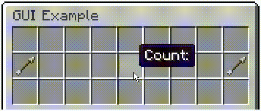

# A Custom GUI Mapmaking Framework Using In-Game Minecraft Commands (Minecraft: Java Edition Datapack)

<p align = "center">
  
</p>

<p align = "center">
  <i>A GUI example demonstrating some of the datapack's features, which was made in less than 5 minutes and in-game!</i>
</p>

## Abstract

Custom user interfaces are very often used to enhance player experience and increase the overall quality of Minecraft maps and servers. While some servers have the convenience of using plugins to base their menus on item-based GUIs, datapacks are hindered by numerous limitations in producing the same results on their own. Due to these limitations, creating item-based GUIs with commands is often proven a very difficult task, with easier, robust alternatives being typically employed on singleplayer worlds and vanilla servers. The aim of this datapack is to serve as a mapmaking framework standardizing the design of item-based GUIs, allowing the user to easily create them in-game, without needing to work on any of the complex backend functionality *or modify the datapack itself*. This can be achieved by simply dragging and dropping items with custom NBT parameters in containers, which can be translated into functional GUIs. Such containers currently only include block entities, such as chests, barrels, droppers, hoppers or even brewing stands. However, the same design may be generalized in the future to work with normal entities, such as chest minecarts.

### Features

The datapack comes with the following features:

* Tools for creating advanced item-based GUIs in-game
* Quick and easy to use
* Fully customizable, without needing to access the datapack's files
* Robust to different user behaviors, without interfering with inventory items
* Works for both singleplayer and multiplayer
* Complete documentation, in-game tutorial and demos

## Downloading, Installing and Updating

The datapack can be downloaded from this repository by clicking on "Code" and then "Download ZIP". The folder inside the ZIP file is the datapack. After this folder has been added to the datapacks folder of a Minecraft world, ``/reload`` needs to be run in-game. A list of the datapack's commands is available via ``/function ajjgui:_help``. By convention, all user functions begin with an underscore, "_", to be distinguished from the backend ones.

| User Function                   | Description                                  |
|:--------------------------------|:---------------------------------------------|
| ``/function ajjgui:_compile``   | Compiles GUI                                 |
| ``/function ajjgui:_copyright`` | Displays datapack copyright information      |
| ``/function ajjgui:_decompile`` | Decompiles GUI                               |
| ``/function ajjgui:_help``      | Displays list of datapack user commands      |
| ``/function ajjgui:_install``   | Installs datapack                            |
| ``/function ajjgui:_kit``       | Gives GUI design and compilation kit         |
| ``/function ajjgui:_manual``    | Displays datapack manual link                |
| ``/function ajjgui:_reload``    | Reloads GUIs                                 |
| ``/function ajjgui:_tutorial``  | Displays GUI design and compilation tutorial |
| ``/function ajjgui:_uninstall`` | Uninstalls datapack                          |
| ``/function ajjgui:_version``   | Displays datapack version                    |
| ``/function ajjgui:_widget/``   | Gives GUI demo widgets                       |

The datapack can be installed by running ``/function ajjgui:_install`` at any location in the world, which generates a 3x1 tower consisting of two command blocks and a shulker box. These block entities are needed for the datapack to be fully functional and, as such, cannot be destroyed. *They must also be placed in a chunk that is constantly loaded.* The tower can be relocated by repeating the installation command, and the previous one generated is automatically removed. The datapack must be reinstalled if an updated version of it has been downloaded. It can be uninstalled using ``/function ajjgui:_uninstall``, which removes all data associated with it from the world, *including any GUIs made with it*.

## GUI Widgets

Every item in a GUI corresponds to a user interface element with a predefined functionality. This is referred to as a *widget*. Depending on their type, widgets exhibit different properties when interacted with (e.g., the *button* widget may change the GUI page and run commands).

There are 8 types of widgets available:

* [Placeholder](#placeholder)
* [Button](#button)
* [Counter](#counter)
* [Switch](#switch)
* [Radiobutton](#radiobutton)
* [Itemslot](#itemslot)
* [Itembin](#itembin)
* [Scrollbutton](#scrollbutton)

## Creating a GUI

An in-game tutorial on how to create a GUI is available via ``/function ajjgui:_tutorial``. The tutorial provides the player with premade demo widgets to experiment with. Multiple examples are given, both here and in-game, to help provide a better understanding of their custom NBT. The following section explains all the different types of widgets available and how they can be customized. Once obtained, these items can be placed inside shulker boxes, with each shulker box corresponding to a different GUI page. The shulker boxes can be arranged based on their page number and compiled to build a functional GUI in-game. This manual can be accessed with ``/function ajjgui:_manual``.

## List of GUI Widgets

> **NOTE:** Some of the following commands are too long to fit in the chat box and need to be executed using a command block.

> **NOTE:** The right data types must be used. Where a byte list is specified, an integer list is also supported for simplicity.

> **NOTE:** The ``ajjgui.Command``, ``ajjgui.Exit``, ``ajjgui.Fixed``, ``ajjgui.Page`` and ``ajjgui.Relative`` NBT tags are covered separately in later sections.

### Placeholder

The *placeholder* is a widget that cannot be interacted with and is used to display an item.

| NBT Tag          | Default | Type           |
|:-----------------|:--------|:---------------|
| ``ajjgui.Fixed`` | ``0b``  | Boolean (Byte) |

#### Usage

```
/give @s <item id>{ajjgui:{Widget:"placeholder"},<other tags for item>}
```

#### Example

```
/give @p minecraft:light_gray_stained_glass_pane{ajjgui:{Widget:"placeholder"},display:{Name:'{"text":"","italic":"false"}'}}
```

<p align = "center">
  
</p>

> **NOTE:** If a GUI slot is empty, the compiler adds a light gray stained glass pane *placeholder* with a blank name in its place.

> **NOTE:** If the ``ajjgui.Widget`` NBT tag of any item is not specified, it is set to ``"placeholder"`` by default. Therefore, the entire ``ajjgui`` argument for any *placeholder* is optional, and no specific tags are required.

### Button

The *button* is a widget that changes the GUI page, exits the GUI and/or runs a GUI command when clicked. More information can be found in the following sections.

| NBT Tag             | Default  | Type           |
|:--------------------|:---------|:---------------|
| ``ajjgui.Command``  | N/A      | String         |
| ``ajjgui.Exit``     | ``0b``   | Boolean (Byte) |
| ``ajjgui.Fixed``    | ``0b``   | Boolean (Byte) |
| ``ajjgui.Page``     | N/A      | Byte           |
| ``ajjgui.Relative`` | ``0b``   | Boolean (Byte) |

#### Usage

```
/give @s <item id>{ajjgui:{Widget:"button"},<other tags for item>}
```

#### Examples

More information about [changing GUI pages](#changing-gui-pages), [exiting GUIs](#exiting-guis) and [running GUI commands](#running-gui-commands-and-accessing-data).

### Counter

The *counter* is a widget that changes to a different count of the same item when clicked, following a value sequence. The value sequence is specified in the ``ajjgui.Values`` NBT tag. The default value is the one initially used upon creation of the widget. Once a *counter* in its default state is clicked, it changes to the second value in the list and so on. Hence, the first one is not used until the end of the first cycle. After one cycle, the first value is always used instead of the default one. The current state of a *counter* is stored in the ``ajjgui.State`` NBT tag.

| NBT Tag             | Default  | Type           |
|:--------------------|:---------|:---------------|
| ``ajjgui.Command``  | N/A      | String         |
| ``ajjgui.Exit``     | ``0b``   | Boolean (Byte) |
| ``ajjgui.Fixed``    | ``0b``   | Boolean (Byte) |
| ``ajjgui.Page``     | N/A      | Byte           |
| ``ajjgui.Relative`` | ``0b``   | Boolean (Byte) |
| ``ajjgui.State``    | ``0b``   | Byte           |
| ``ajjgui.Values``   | Required | Byte List      |

#### Usage

```
/give @s <item id>{ajjgui:{Widget:"counter",Values:[<value 1>,<value 2>,…,<value N>]},<other tags for item>} <default value>
```

where N is the number of states.

#### Examples

1. A *counter* repeating the sequence 1 to 16, starting with 1. The default value is the same as the first value in ``ajjgui.Values``:

```
/give @p minecraft:black_stained_glass_pane{ajjgui:{Widget:"counter",Values:[1,2,3,4,5,6,7,8,9,10,11,12,13,14,15,16]},display:{Name:'{"text":"Count:","italic":"false"}'}}
```

2. A *counter* repeating the sequence 1 to 4, starting with 1. The default value is the same as the first value in ``ajjgui.Values``:

```
/give @p minecraft:black_stained_glass_pane{ajjgui:{Widget:"counter",Values:[1,2,3,4]},display:{Name:'{"text":"Count:","italic":"false"}'}}
```

3. A *counter* beginning with a default value of 64, followed by the sequence 2 to 16, that continues by repeating the sequence 1 to 16:

```
/give @p minecraft:black_stained_glass_pane{ajjgui:{Widget:"counter",Values:[1,2,3,4,5,6,7,8,9,10,11,12,13,14,15,16]},display:{Name:'{"text":"Count:","italic":"false"}'}} 64
```

4. A *counter* repeating the sequence 1 to 16, starting with 16. The default value is the same as the first value in ``ajjgui.Values`` (now rearranged). The value of ``ajjgui.State`` is set to ``1b`` to match the states:

```
/give @p minecraft:black_stained_glass_pane{ajjgui:{Widget:"counter",Values:[16,1,2,3,4,5,6,7,8,9,10,11,12,13,14,15],State:15b},display:{Name:'{"text":"Count:","italic":"false"}'}} 16
```

<p align = "center">
  
</p>

### Switch

The *switch* is a widget that changes to a different item when clicked, following an item sequence. The item sequence is specified in the ``ajjgui.Items`` NBT tag. The default item is the one initially used upon creation of the widget. Once a *switch* in its default state is clicked, it changes to the second item in the list and so on. Hence, the first one is not used until the end of the first cycle. After one cycle, the first item is always used instead of the default one. The current state of a *switch* is stored in the ``ajjgui.State`` NBT tag.

| NBT Tag             | Default  | Type           |
|:--------------------|:---------|:---------------|
| ``ajjgui.Command``  | N/A      | String         |
| ``ajjgui.Exit``     | ``0b``   | Boolean (Byte) |
| ``ajjgui.Fixed``    | ``0b``   | Boolean (Byte) |
| ``ajjgui.Items``    | Required | Compound List  |
| ``ajjgui.Page``     | N/A      | Byte           |
| ``ajjgui.Relative`` | ``0b``   | Boolean (Byte) |
| ``ajjgui.State``    | ``0b``   | Byte           |

#### Usage

```
/give @s <default item id>{ajjgui:{Widget: "switch",Items:[<item 1>,<item 2>,…,<item N>]},<other tags for default item>}
```

where N is the number of states.

#### Examples

1. A *switch* changing between a "Disabled" and an "Enabled" state, starting with "Disabled". The default item is the same as the first item in ``ajjgui.Items``:

```
/give @p minecraft:gray_dye{ajjgui:{Widget:"switch",Items:[{id:"minecraft:gray_dye",Count:1b,tag:{display:{Name:'{"text":"Disabled","italic":"false"}'}}},{id:"minecraft:lime_dye",Count:1b,tag:{display:{Name:'{"text":"Enabled","italic":"false"}'}}}]},display:{Name:'{"text":"Disabled","italic":"false"}'}}
```

2. A *switch* changing between a "Disabled", an "Enabled" and a "Neutral" state, starting with "Disabled". The default item is the same as the first item in ``ajjgui.Items``:

```
/give @s minecraft:gray_dye{ajjgui:{Widget:"switch",Items:[{id:"minecraft:gray_dye",Count:1b,tag:{display:{Name:'{"text":"Disabled","italic":"false"}'}}},{id:"minecraft:lime_dye",Count:1b,tag:{display:{Name:'{"text":"Enabled","italic":"false"}'}}},{id:"minecraft:purple_dye",Count:1b,tag:{display:{Name:'{"text":"Neutral","italic":"false"}'}}}]},display:{Name:'{"text":"Disabled","italic":"false"}'}}
```

3. A *switch* beginning with a default state, "Default", that continues by changing between a "Disabled" and an "Enabled" state, starting with "Enabled":

```
/give @p minecraft:purple_dye{ajjgui:{Widget:"switch",Items:[{id:"minecraft:gray_dye",Count:1b,tag:{display:{Name:'{"text":"Disabled","italic":"false"}'}}},{id:"minecraft:lime_dye",Count:1b,tag:{display:{Name:'{"text":"Enabled","italic":"false"}'}}}]},display:{Name:'{"text":"Default","italic":"false"}'}}
```

4. A *switch* changing between a "Disabled" and an "Enabled" state, starting with "Enabled". The default item is the same as the first item in ``ajjgui.Items`` (now rearranged). The value of ``ajjgui.State`` is set to ``1b`` to match the states:

```
/give @p minecraft:lime_dye{ajjgui:{Widget:"switch",Items:[{id:"minecraft:lime_dye",Count:1b,tag:{display:{Name:'{"text":"ON","italic":"false"}'}}},{id:"minecraft:gray_dye",Count:1b,tag:{display:{Name:'{"text":"OFF","italic":"false"}'}}}],State:1b},display:{Name:'{"text":"ON","italic":"false"}'}}
```

<p align = "center">
  
</p>

### Radiobutton

The *radiobutton* is a widget that changes between an "OFF" and "ON" state item when clicked. It comes in groups in which only one widget can be toggled on at a time, with the rest being toggled off. Each item is specified in the ``ajjgui.OFF`` and ``ajjgui.ON`` NBT tags. The default item is the one initially used upon creation of the widget. Once a *radiobutton* is clicked, it changes to the item corresponding to its "ON" state, and all the other *radiobutton* widgets with the same group identifier change to their "OFF" state. The group identifier of a *radiobutton* is stored in the ``ajjgui.Group`` NBT tag. The current state of a *radiobutton* is stored in the ``ajjgui.State`` NBT tag.

| NBT Tag             | Default  | Type           |
|:--------------------|:---------|:---------------|
| ``ajjgui.Command``  | N/A      | String         |
| ``ajjgui.Exit``     | ``0b``   | Boolean (Byte) |
| ``ajjgui.Fixed``    | ``0b``   | Boolean (Byte) |
| ``ajjgui.Group``    | ``0b``   | Byte           |
| ``ajjgui.OFF``      | Required | Compound       |
| ``ajjgui.ON``       | Required | Compound       |
| ``ajjgui.Page``     | N/A      | Byte           |
| ``ajjgui.Relative`` | ``0b``   | Boolean (Byte) |
| ``ajjgui.State``    | ``0b``   | Byte           |

#### Usage

```
/give @s <default item id>{ajjgui:{Widget:"radiobutton",OFF:<off item>,ON:<on item>,Group:<group>},<other tags for default item>}
```

#### Examples

1. A *radiobutton* on group ``0b`` changing between a "Not Selected" and a "Selected" state, starting with "Not Selected":

```
/give @p minecraft:gray_dye{ajjgui:{Widget:"radiobutton",OFF:{id:"minecraft:gray_dye",Count:1b,tag:{display:{Name:'{"text":"Not Selected","italic":"false"}'}}},ON:{id:"minecraft:lime_dye",Count:1b,tag:{display:{Name:'{"text":"Selected","italic":"false"}'}}},Group:0b},display:{Name:'{"text":"Not Selected","italic":"false"}'}}
```

2. A *radiobutton* on group ``0b`` beginning with a default state, "Default", that continues by changing between a "Not Selected" and a "Selected" state, starting with "Selected":

```
/give @p minecraft:purple_dye{ajjgui:{Widget:"radiobutton",OFF:{id:"minecraft:gray_dye",Count:1b,tag:{display:{Name:'{"text":"Not Selected","italic":"false"}'}}},ON:{id:"minecraft:lime_dye",Count:1b,tag:{display:{Name:'{"text":"Selected","italic":"false"}'}}},Group:0b},display:{Name:'{"text":"Default","italic":"false"}'}}
```

3. A *radiobutton* on group ``0b`` changing between a "Not Selected" and a "Selected" state, starting with "Selected". The value of ``ajjgui.State`` is set to ``1b`` to match the states:

```
/give @p minecraft:lime_dye{ajjgui:{Widget:"radiobutton",OFF:{id:"minecraft:gray_dye",Count:1b,tag:{display:{Name:'{"text":"Not Selected","italic":"false"}'}}},ON:{id:"minecraft:lime_dye",Count:1b,tag:{display:{Name:'{"text":"Selected","italic":"false"}'}}},Group:0b,State:1b},display:{Name:'{"text":"Selected","italic":"false"}'}}
```

<p align = "center">
  
</p>

### Itembin

The *itembin* is a widget that clears all items inserted by the player in a particular slot in the GUI.

| NBT Tag             | Default  | Type           |
|:--------------------|:---------|:---------------|
| ``ajjgui.Command``  | N/A      | String         |
| ``ajjgui.Exit``     | ``0b``   | Boolean (Byte) |
| ``ajjgui.Fixed``    | ``0b``   | Boolean (Byte) |
| ``ajjgui.Page``     | N/A      | Byte           |
| ``ajjgui.Relative`` | ``0b``   | Boolean (Byte) |

#### Usage

```
/give @s <item id>{ajjgui:{Widget:"itembin"},<other tags for item>}
```

#### Example

```
/give @p minecraft:bucket{ajjgui:{Widget:"itembin"},display:{Name:'{"text":"Recycle Bin","italic":"false"}'}}
```

<p align = "center">
  
</p>

### Itemslot

The *itemslot* is a widget that stores items inserted by the player in a particular slot in the GUI. Once one or more stacked items are inserted, the current ones occupying the slot (if any) are replaced and returned to the player's inventory. When the *itemslot* is not being used, a placeholder item occupies the slot. This is stored in the ``ajjgui.Placeholder`` NBT tag. The maximum number of items in an *itemslot* is stored in the ``ajjgui.Size`` NBT tag, which cannot be larger than ``64b``. Any excess items are returned to the player. Whether an *itemslot* has an item in it is determined by the ``ajjgui.State`` NBT tag.

| NBT Tag                | Default  | Type           |
|:-----------------------|:---------|:---------------|
| ``ajjgui.Command``     | N/A      | String         |
| ``ajjgui.Exit``        | ``0b``   | Boolean (Byte) |
| ``ajjgui.Fixed``       | ``0b``   | Boolean (Byte) |
| ``ajjgui.Page``        | N/A      | Byte           |
| ``ajjgui.Placeholder`` | Required | Compound       |
| ``ajjgui.Relative``    | ``0b``   | Boolean (Byte) |
| ``ajjgui.Size``        | ``64b``  | Byte           |
| ``ajjgui.State``       | ``0b``   | Byte           |

#### Usage

```
/give @s <default item id>{ajjgui:{Widget:"itemslot",Placeholder:<placeholder item>,Size:<stack size>},<other tags for default item>}
```

#### Examples

1. An *itemslot* with a default placeholder item identical to the one specified in ``ajjgui.Placeholder`` and a stack size of ``64b``:

```
/give @p minecraft:gray_stained_glass_pane{ajjgui:{Widget:"itemslot",Placeholder:{id:"minecraft:gray_stained_glass_pane",Count:1b,tag:{display:{Name:'{"text":"Placeholder Item","italic":"false"}'}}},Size:64b},display:{Name:'{"text":"Placeholder Item","italic":"false"}'}}
```

2. An *itemslot* with a default placeholder item identical to the one specified in ``ajjgui.Placeholder`` and a stack size of ``16b``:

```
/give @p minecraft:gray_stained_glass_pane{ajjgui:{Widget:"itemslot",Placeholder:{id:"minecraft:gray_stained_glass_pane",Count:1b,tag:{display:{Name:'{"text":"Placeholder Item","italic":"false"}'}}},Size:16b},display:{Name:'{"text":"Placeholder Item","italic":"false"}'}}
```

3. An *itemslot* with a default placeholder item different from the one specified in ``ajjgui.Placeholder`` and a stack size of ``64b``:

```
/give @p minecraft:white_stained_glass_pane{ajjgui:{Widget:"itemslot",Placeholder:{id:"minecraft:gray_stained_glass_pane",Count:1b,tag:{display:{Name:'{"text":"Placeholder Item","italic":"false"}'}}},Size:64b},display:{Name:'{"text":"Default Placeholder Item","italic":"false"}'}}
```

4. An *itemslot* with an item in it by default and a stack size of ``64b``. The value of ``ajjgui.State`` is set to ``1b`` since the slot is occupied:

```
/give @p minecraft:diamond_sword{ajjgui:{Widget:"itemslot",Placeholder:{id:"minecraft:gray_stained_glass_pane",Count:1b,tag:{display:{Name:'{"text":"Placeholder Item","italic":"false"}'}}},Size:64b,State:1b},display:{Name:'{"text":"Default Item","italic":"false"}'}}
```

<p align = "center">
  
</p>

### Scrollbutton

The *scrollbutton* is a widget that cycles one or more lists of *static* widgets (see notes) across respective GUI slot lists when clicked. This allows for additional space in the GUI. Each widget list is specified in the ``ajjgui.Widgets`` NBT tag. Within each widget list, widgets are added in the order they appear in. The slot list associated with each widget list is specified in the ``ajjgui.Slots`` NBT tag. Within each slot list, slots are added in the order they are occupied by the respective widget list. The *scrollbutton* also contains the entire functionality of the *switch*, including the ``ajjgui.Items`` and ``ajjgui.State`` NBT tags.

| NBT Tag             | Default  | Type               |
|:--------------------|:---------|:-------------------|
| ``ajjgui.Command``  | N/A      | String             |
| ``ajjgui.Exit``     | ``0b``   | Boolean (Byte)     |
| ``ajjgui.Fixed``    | ``0b``   | Boolean (Byte)     |
| ``ajjgui.Items``    | N/A      | Compound List      |
| ``ajjgui.Page``     | N/A      | Byte               |
| ``ajjgui.Relative`` | ``0b``   | Boolean (Byte)     |
| ``ajjgui.Slots``    | Required | Byte List List     |
| ``ajjgui.State``    | ``0b``   | Byte               |
| ``ajjgui.Widgets``  | Required | Compound List List |

#### Usage

```
/give @s <item id>{ajjgui:{Widget:"scrollbutton",Widgets:[[<widget 1,1>,<widget 1,2>,…,<widget 1,L_1>],[<widget 2,1>,<widget 2,2>,…,<widget 2,L_2>],…,[<widget N,1>,<widget N,2>,…,<widget N,L_N>]],Slots:[[<slot 1,1>,<slot 1,2>,…,<slot 1,M_1>],[<slot 2,1>,<slot 2,2>,…,<slot 2,M_2>],…,[<slot N,1>,<slot N,2>,…,<slot N,M_N>]]},<other tags for item>}
```

where L_x and M_y are the numbers of widgets and slots in each widget list and slot list respectively, and N is the number of widget list and slot list pairs.

#### Example

A *scrollbutton* cycling 6 buttons across GUI slots 11, 12, 13 and 14. Each button leads to a different page when clicked. There is a single widget list of length 6 and a single slot list of length 4:

```
/give @p minecraft:spectral_arrow{ajjgui:{Widget:"scrollbutton",Widgets:[[{id:"minecraft:paper",Count:1b,tag:{ajjgui:{Widget:"button",Page:0b},display:{Name:'{"text":"Select","italic":"false"}'}}},{id:"minecraft:paper",Count:2b,tag:{ajjgui:{Widget:"button",Page:1b},display:{Name:'{"text":"Select","italic":"false"}'}}},{id:"minecraft:paper",Count:3b,tag:{ajjgui:{Widget:"button",Page:2b},display:{Name:'{"text":"Select","italic":"false"}'}}},{id:"minecraft:paper",Count:4b,tag:{ajjgui:{Widget:"button",Page:3b},display:{Name:'{"text":"Select","italic":"false"}'}}},{id:"minecraft:paper",Count:5b,tag:{ajjgui:{Widget:"button",Page:4b},display:{Name:'{"text":"Select","italic":"false"}'}}},{id:"minecraft:paper",Count:6b,tag:{ajjgui:{Widget:"button",Page:5b},display:{Name:'{"text":"Select","italic":"false"}'}}}]],Slots:[[11,12,13,14]]},display:{Name:'{"text":"Next","italic":"false"}'}}
```

<p align = "center">
  
</p>

> **NOTE:** The *scrollbutton* does not display any of its entries in the GUI by default and needs to be initialized upon compilation.

> **NOTE:** The *scrollbutton* only supports the *placeholder*, *button* and *itembin* widgets.

> **NOTE:** If the ``ajjgui.Widget`` NBT tag of any widget is not specified, it is set to ``"placeholder"`` by default. Therefore, the entire ``ajjgui`` argument for any *placeholder* is optional, and no specific tags are required. This, by extension, applies to widgets specified in ``ajjgui.Widgets``.

## Changing GUI Pages

Each of the above widgets, excluding the *placeholder*, can be made to change the GUI page when clicked. This is done by specifying a page number in the ``ajjgui.Page`` NBT tag. By default, this value is the index of the shulker box in the chest previously used to compile the GUI, where a value of ``0b`` corresponds to the first page. If it is equal to the number of pages, the count resets back to the first page, and negative values may also be used to access pages from the end. The ``ajjgui.Relative`` NBT tag can be set to ``1b`` in order for the value of ``ajjgui.Page`` to increment the page number from its current value. This, hence, assumes that the current page has an index of ``0b`` and uses this as a reference instead of the first one.

#### Examples

1. A *button* setting the GUI page to the first one:

```
/give @p minecraft:arrow{ajjgui:{Widget:"button",Page:0b},display:{Name:'{"text":"Go to First Page","italic":"false"}'}}
```

2. A *button* setting the GUI page to the last one:

```
/give @p minecraft:arrow{ajjgui:{Widget:"button",Page:-1b},display:{Name:'{"text":"Go to Last Page","italic":"false"}'}}
```

3. A *button* setting the GUI page to the next one:

```
/give @p minecraft:arrow{ajjgui:{Widget:"button",Page:1b,Relative:1b},display:{Name:'{"text":"Go to Next Page","italic":"false"}'}}
```

4. A *button* setting the GUI page to the previous one:

```
/give @p minecraft:arrow{ajjgui:{Widget:"button",Page:-1b,Relative:1b},display:{Name:'{"text":"Go to Previous Page","italic":"false"}'}}
```

<p align = "center">
  
</p>

## Fixed GUI Widgets

Each of the above widgets can be made to stay on display when the GUI page is changed. This is done by setting the ``ajjgui.Fixed`` NBT tag to ``1b``. If a *scrollbutton* is made fixed, its widgets also obtain this property.

### Example

A *button* staying fixed in its slot when the GUI page is changed:

```
/give @p minecraft:arrow{ajjgui:{Widget:"button",Page:1b,Relative:1b,Fixed:1b},display:{Name:'{"text":"Go to Next Page","italic":"false"}'}}
```

## Exiting GUIs

Each of the above widgets, excluding the *placeholder*, can be made to exit the GUI when clicked. This is done by setting the ``ajjgui.Exit`` NBT tag to ``1b``.

### Example

A *button* exiting the GUI:

```
/give @p minecraft:barrier{ajjgui:{Widget:"button",Exit:1b},display:{Name:'{"text":"Exit","color":"white","italic":"false"}'}}
```

## Running GUI Commands and Accessing Data

Each of the above widgets, excluding the the *placeholder*, can be made to run commands or functions when clicked. This is done by specifying a command in the ``ajjgui.Command`` NBT tag. This command is executed by an external command block instead of the player themselves. The ``"ajjgui.user"`` scoreboard tag can be used to target the player triggering the widget. In this way, it is also possible to access the count, page, slot and state values of the selected widget, stored respectively in the ``ajjgui.count``, ``ajjgui.page``, ``ajjgui.slot`` and ``ajjgui.state`` scores of this player. The NBT of the selected widget is accessible from the ``Widget`` NBT tag in the ``ajjgui:gui`` data storage. Any items added or removed from an *itemslot* are accessible from the ``In`` and ``Out`` NBT tags respectively in the ``ajjgui:itemslot`` data storage. Likewise, any items added to an *itembin* are accessible from the ``In`` NBT tag in the ``ajjgui:itembin`` data storage.

### Examples

1. A *button* running a command referencing the player that pressed it:

```
/give @p minecraft:arrow{ajjgui:{Widget:"button",Page:1b,Relative:1b,Command:"execute as @a[tag=ajjgui.user] run say pressed button to Next Page"},display:{Name:'{"text":"Go to Next Page","italic":"false"}'}}
```

2. A *switch* running a command based on its current state:

Assume the following commands are located in a function ```name:func``` within another datapack:

```
execute if score @s ajjgui.state matches 0 run say set switch to Disabled
execute if score @s ajjgui.state matches 1 run say set switch to Enabled
```

A *switch* running a function as the player that pressed it:

```
/give @p minecraft:gray_dye{ajjgui:{Widget:"switch",Items:[{id:"minecraft:gray_dye",Count:1b,tag:{display:{Name:'{"text":"Disabled","italic":"false"}'}}},{id:"minecraft:lime_dye",Count:1b,tag:{display:{Name:'{"text":"Enabled","italic":"false"}'}}}],Command:"execute as @a[tag=ajjgui.user] run function name:func"},display:{Name:'{"text":"Disabled","italic":"false"}'}}
```

## Manually Modifying GUIs

For every GUI compiled, there is a marker entity located at the container's coordinates with the ``"ajjgui.gui"`` scoreboard tag. This entity stores the page value in its ``ajjgui.page`` score as well as the page list in its ``data.GUI`` NBT tag. Each element in this list corresponds to a page, storing widgets in the same format containers use to store items. If the available widget types and tags do not already support a particular functionality, the page number and widget NBT may be manually modified to achieve desired results. In order for the changes to be applied, ``/function ajjgui:_reload`` needs to be run. Otherwise, the GUI is updated upon user interaction. *It is highly recommended to to read the rest of the documentation before proceeding with such modifications as any existing alternatives may be substantially easier to work with.*

### Examples

1. A command setting the nearest GUI's page to the first one:

```
/scoreboard players set @e[type=minecraft:marker,tag=ajjgui.gui,sort=nearest,limit=1] ajjgui.page 0
/function ajjgui:_reload
```

2. A command setting the nearest GUI's first page's first slot item's id to stone:

```
/data modify entity @e[type=minecraft:marker,tag=ajjgui.gui,sort=nearest,limit=1] data.GUI[0][{Slot:0b}].id set value "minecraft:stone"
/function ajjgui:_reload
```

> **NOTE:** The compiler adds the ``ajjgui.Slot`` and ``ajjgui.Compiled`` NBT tags to each widget. These two must not be changed when manually modifying NBT.

> **NOTE:** Decompiling a GUI reverts any NBT changes to widgets, manual or not.

## Copyright

Copyright © 2021 - 2023 Ajj (https://github.com/AjjMC/ajjgui)

This project was released under the MIT License. Please credit this datapack if you use it in your work by providing a link to the project repository.
